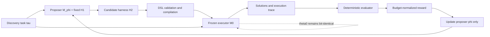

# Amortized Harness Synthesis for Discovery

> Project execution plan (v1.0, 2026-07-22)  
> Working name: **HarnessRL**  
> Core thesis: train a harness proposer to generate better discovery harnesses for a **permanently frozen base model**.

---

## 0. Highest-Priority Instructions for the Implementation Agent

These are immutable project constraints. If an implementation idea, experiment, or refactor conflicts with this section, this section wins.

1. **The executor `M0` must remain frozen from the beginning to the end of the project.** Never apply SFT, DPO, PPO, GRPO, LoRA, test-time training, continual learning, or any other parameter update to `M0`.
2. The only trainable model parameters are the harness-proposer parameters `phi`. The recommended implementation is a proposer LoRA on the same base checkpoint:

   ```text
   proposer = M0 + proposer_lora(phi)
   executor = M0 without any adapter
   ```

3. Keep the proposer harness `H1` fixed:

   ```text
   proposer M_phi + fixed H1 + task specification -> candidate H2
   frozen executor M0 + candidate H2 -> discovery rollouts -> reward
   reward -> update phi only
   ```

4. `H2` may change prompts, context construction, memory, search, candidate selection, reflection, tool orchestration, and budget allocation. It must **not** modify the parameters, checkpoint, adapter state, or serving configuration of `M0`.
5. Compare candidate harnesses using the same `M0` checkpoint, task, evaluator, budget, and paired random seeds. A harness must not hide additional model calls, tokens, evaluator queries, or compute.
6. The primary claim is **amortized harness generation**: after training across tasks, the proposer should generate a strong harness for an unseen task in one or very few attempts. The primary experiment is not unlimited per-task harness search.
7. Do not describe this project as model–harness co-optimization, solver self-training, or recursive weight self-improvement. The executor is deliberately frozen to make harness benefits identifiable.
8. Run all generated code in an offline sandbox with strict time, memory, process, and filesystem limits. The MVP must use a typed harness DSL rather than arbitrary Python harness code.

If an agent believes that updating executor weights would improve performance, record that idea under future work. Do not implement it in this project.

---

## 1. Executive Summary

### 1.1 Research question

Given a frozen base model `M0`, can downstream feedback from many hard discovery tasks train a model `M_phi` to generate executable, task-conditioned harnesses `H2` that make `M0` a better discovery system?

The project does not attempt to improve the parameters of `M0`. It attempts to learn how to:

- organize repeated calls to `M0`;
- maintain solution populations and external memory;
- use evaluator feedback;
- choose when to explore, exploit, restart, cross over, or reflect;
- allocate a fixed computation budget;
- find a better final solution under that fixed budget.

### 1.2 One-sentence method

Treat an entire harness as a temporally extended action from the proposer, execute that action with a frozen executor, and use the resulting downstream discovery utility as a black-box reward for training the proposer.

### 1.3 Target contribution statement

> We train a language model to synthesize executable discovery harnesses for a permanently frozen executor, amortizing expensive per-task harness search across tasks while preserving clean attribution of downstream gains to the harness.

### 1.4 Intended empirical result

On unseen discovery tasks, under matched target-time model calls, tokens, evaluator queries, and runtime:

- harnesses from the learned proposer outperform the initial simple harness;
- they outperform harnesses from the untrained proposer;
- they outperform random and evolutionary per-task harness search at the same target-time budget;
- they approach the performance of much larger per-task harness searches while using fewer harness evaluations;
- their gains repeat on the frozen `M0` across paired seeds and can be attributed to the harness intervention.

---

## 2. Definitions and Formal Objective

| Symbol | Meaning | Updated? |
|---|---|---:|
| `M0`, `theta0` | Frozen base model, e.g. a Qwen 3.5 9B checkpoint | Never |
| `M_phi` | Harness proposer initialized from `M0` | Only `phi` |
| `H1` | Fixed proposer system/runtime harness | No |
| `H2` | Generated problem-solving/discovery harness | Generated per proposal |
| `tau` | Discovery task: public specification, evaluator, and budget | No |
| `B` | Strict executor cost budget | No |
| `omega` | Paired rollout/environment random seed | Controlled |
| `Y` | Solution trajectory produced by `M0 + H2` | Output |
| `R` | Reward computed from trajectory, solution quality, and cost | Black-box signal |

### 2.1 Computation graph



### 2.2 Formal objective

Sample tasks from a meta-training distribution:

\[
\tau \sim p_{\mathrm{train}}(\tau).
\]

Generate `K` candidate harnesses:

\[
H_j \sim \pi_\phi(H\mid \tau,H_1),
\qquad j=1,\ldots,K.
\]

Execute every candidate with the same frozen model:

\[
\mathcal Y_j =
\operatorname{Execute}(M_0,H_j,\tau;B,\omega).
\]

Train only the proposer:

\[
\max_\phi
\mathbb E_{\tau,H\sim\pi_\phi}
\left[R(M_0,H,\tau;B)\right],
\]

subject to:

\[
\theta_0^{(t+1)}=\theta_0^{(t)}=\theta_0.
\]

### 2.3 Attribution design

Use paired improvement under the same task, budget, and seed:

\[
\Delta R_j=
R(M_0,H_j;\tau,B,\omega)
-R(M_0,H_{\mathrm{ref}};\tau,B,\omega).
\]

Because `M0` is frozen, expected differences between candidate harnesses come from the harness and its interaction with the fixed model, not from solver-weight drift. Repeated paired seeds are still required to control sampling noise.

---

## 3. Research Questions and Falsifiable Hypotheses

### RQ1. Can downstream reward train a harness proposer?

Compare the untrained proposer, elite SFT, preference optimization, and online RL using top-1 harness performance on unseen tasks.

Success criterion: at the same one-shot generation budget, the trained proposer significantly outperforms the untrained proposer on held-out ID tasks.

### RQ2. Can cross-task learning amortize harness search?

Compare the learned proposer with random, evolutionary, GEPA-style, and Meta-Harness-style per-task search using performance versus target-task harness evaluations.

Success criterion: the learned proposer reaches the same performance using fewer target-task harness evaluations. Also report the lifecycle break-even point after including proposer-training cost.

### RQ3. Does the improvement come from harness quality rather than extra compute?

Every method must report:

- proposer input/output tokens;
- executor input/output tokens;
- model calls;
- evaluator queries;
- sandbox CPU time;
- accelerator time;
- wall-clock time.

The primary comparison matches executor tokens and model calls. A sensitivity analysis should also match GPU-seconds or monetary cost.

### RQ4. Does the proposer learn reusable discovery structure?

Evaluate three levels of generalization:

1. unseen instances of a known task;
2. unseen tasks from known families;
3. unseen task families or domains.

### RQ5. Are learned harnesses specifically adapted to `M0`?

Cross-execute a harness learned for `M0` on other frozen models. The expected result is strongest performance on the target model with partial transfer of structural strategies.

### RQ6. Which harness components cause improvement?

Attribute changes to:

- prompts and instructions;
- context selection;
- population and archive management;
- mutation, reflection, and crossover operators;
- selection and exploration policy;
- restart and stagnation logic;
- evaluator-feedback handling;
- compute allocation.

Use component ablations and counterfactual replay. Do not rely only on qualitative interpretation of generated harness text.

---

## 4. Scope and Non-Goals

### 4.1 MVP scope

- one frozen executor checkpoint `M0`;
- one proposer adapter `phi`;
- a fixed `H1`;
- a typed and versioned harness DSL;
- automatically verifiable, inexpensive discovery tasks;
- objective outcome rewards rather than LLM-as-judge rewards;
- one-shot and few-shot amortized evaluation;
- SFT/DPO bootstrapping followed by candidate-level online RL.

### 4.2 Explicit non-goals

- updating the executor;
- allowing `H2` to train the executor;
- claiming recursive self-improvement;
- using a single benchmark such as Terminal-Bench as the central contribution;
- reporting the best result from unlimited harness search as learned-proposer performance;
- using any test set for checkpoint, hyperparameter, or harness selection;
- allowing arbitrary code in the MVP harness action space;
- treating longer prompts or more model calls as algorithmic improvement.

---

## 5. Harness Representation

### 5.1 MVP: typed Harness DSL

The proposer emits YAML or JSON that is parsed into a strict internal JSON schema and canonicalized before execution.

```yaml
version: "0.1"

budget:
  max_model_calls: 16
  max_total_tokens: 24000
  max_evaluator_calls: 32

initialization:
  num_candidates: 4
  strategy: diverse_independent
  temperature: 0.8

archive:
  capacity: 12
  retention: quality_diversity
  elite_count: 3
  deduplication: semantic_and_exact

selection:
  strategy: novelty_weighted_elite
  tournament_size: 3
  quality_weight: 0.75
  novelty_weight: 0.25

variation:
  operators:
    - targeted_repair
    - conceptual_rewrite
    - crossover
  operator_weights: [0.45, 0.35, 0.20]
  include_failure_feedback: true
  include_parent_diff: true

context:
  include_task_spec: true
  include_best_solution: true
  include_top_k_summaries: 3
  include_recent_failures: 2
  max_context_tokens: 6000

stagnation:
  patience: 3
  action: restart_from_best_with_new_strategy

prompts:
  initial: "..."
  mutate: "..."
  critique: "..."
  crossover: "..."

termination:
  stop_on_budget: true
  stop_on_target_score: true
```

### 5.2 DSL design requirements

1. Every field has a type, range, and default.
2. Every accepted field must affect runtime behavior; inactive fields do not count as innovations.
3. Compilation produces a canonical representation and hash for deduplication and replay.
4. The DSL cannot contain shell commands, network requests, arbitrary paths, model checkpoints, adapters, optimizers, or training instructions.
5. Prompt fields have strict length limits and cannot contain private benchmark data.
6. Runtime code enforces budgets externally; the harness never self-reports usage.
7. Unknown fields fail closed.

### 5.3 Phase-two restricted modules

Only after the DSL validates the core hypothesis should the system allow restricted Python functions such as:

```python
def select_parent(state) -> str: ...
def build_context(state, budget) -> str: ...
def choose_operator(state) -> str: ...
def should_restart(state) -> bool: ...
```

Restricted modules must:

- run in a sandbox;
- have no network access;
- access only structured state;
- pass an AST allowlist;
- obey CPU, memory, and time limits;
- be unable to modify the evaluator;
- be unable to load or modify a model.

Arbitrary code harnesses are not required for the MVP.

---

## 6. Frozen Executor Runtime

### 6.1 Runtime responsibilities

`HarnessExecutor` accepts `(task, canonical_harness, M0, budget, seed)` and:

1. initializes task state and the solution archive;
2. generates initial candidates according to `H2`;
3. invokes the task evaluator;
4. updates best-so-far, archive, and failure summaries;
5. chooses parents, operators, and context according to `H2`;
6. calls frozen `M0` for new candidates;
7. terminates on budget exhaustion or an explicit stop condition;
8. returns a replayable trajectory and complete budget ledger.

### 6.2 Executor invariants

At startup and shutdown, verify:

- the base checkpoint hash is unchanged;
- the executor loaded no trainable adapter;
- no executor optimizer exists;
- all executor parameters have `requires_grad=False`;
- no backward pass or optimizer step occurred;
- proposer adapters cannot leak through a shared serving route.

Add a negative test that deliberately attempts to load an adapter into the executor and confirms an immediate hard failure.

### 6.3 Serving architecture

Preferred during research:

- an independent executor inference server exposing only `M0`;
- an independent proposer process loading `M0 + LoRA_phi`;
- distinct endpoints and configuration files.

Possible later optimization:

- one multi-LoRA server;
- executor route forces `adapter=None`;
- proposer route forces `adapter=proposer_phi`;
- every request logs route, adapter ID, checkpoint hash, and budget usage.

Use the separate-server design until isolation tests are mature.

---

## 7. Task API and Benchmark Construction

### 7.1 Common task interface

```python
class DiscoveryTask(Protocol):
    task_id: str
    family: str
    direction: Literal["maximize", "minimize"]

    def public_spec(self) -> str: ...
    def initial_artifact(self) -> str | None: ...
    def validate(self, artifact: str) -> ValidationResult: ...
    def evaluate_public(self, artifact: str, seed: int) -> Score: ...
    def evaluate_private(self, artifact: str, seed: int) -> Score: ...
    def normalize(self, raw_score: float) -> float: ...
```

Every task must define:

- machine-readable metadata;
- a public problem statement;
- a candidate artifact format;
- deterministic validity checks;
- a public feedback evaluator;
- a private or authoritative evaluator;
- score direction and normalization;
- resource limits;
- a reference baseline;
- source and license provenance.

### 7.2 Evaluation regimes

**Instance-based tasks**

- `M0 + H2` may use public development instances;
- meta-train harness reward is computed on private instances of that meta-train task;
- final test-task private instances remain sealed.

**Single-objective discovery tasks**

- examples: circle packing or low-autocorrelation sequences;
- a public evaluator provides optimization feedback;
- an authoritative validator checks all constraints and reward-hacking conditions;
- generalization is evaluated mainly through task-level and family-level splits.

**Program or heuristic tasks**

- public instances guide search;
- private instances test algorithmic generalization;
- runtime metrics use repeated, stabilized measurements.

### 7.3 Staged task suite

#### Phase A: infrastructure/debug tasks

Use 4–8 inexpensive deterministic tasks that do not contribute to the final claim:

- numerical function optimization;
- small knapsack heuristics;
- small-graph Max-Cut;
- simplified online bin packing;
- low-autocorrelation binary sequences;
- small circle-packing problems.

Each evaluator should run on CPU in less than one second and use deterministic or explicitly seeded behavior.

#### Phase B: controlled cross-task meta-training suite

Initial target: 80–160 task identities across at least four families.

Recommended families:

1. **Sequence construction:** binary/ternary sequences, autocorrelation, pattern avoidance;
2. **Graph construction and heuristics:** Max-Cut, independent set, coloring, dominating set;
3. **Packing and scheduling:** online bin packing, knapsack, job scheduling, routing heuristics;
4. **Continuous geometry:** circle or point packing, minimum-distance placement, small Heilbronn-style tasks;
5. **Symbolic/model discovery:** symbolic regression and small programmatic model search;
6. **Program optimization:** correctness-constrained CPU algorithm microbenchmarks.

Train initially on four families. Hold out at least one compositional family and one fully OOD family.

Splits must hold out task definitions, objectives, or generators. Different random seeds of the same template do not count as unseen tasks.

#### Phase C: external benchmark stress tests

After the core method is stable, integrate:

- reproducible tasks from [TTT-Discover](https://arxiv.org/abs/2601.16175), including circle-packing, autocorrelation, or algorithmic environments;
- the [TTT-Discover repository](https://github.com/test-time-training/discover);
- held-out tasks with reconstructable evaluators from [EFT/Finch Collection](https://huggingface.co/datasets/minnesotanlp/Finch-Collection);
- examples from [OpenEvolve](https://github.com/algorithmicsuperintelligence/openevolve);
- ALE/AtCoder-style heuristic tasks where licensing and evaluators permit.

Phase C must not influence checkpoint selection for Phase B. It is an external generalization test.

### 7.4 Required splits

```text
meta_train/
    tasks used to update phi
meta_validation/
    unseen tasks used for checkpoint and hyperparameter selection
meta_test_id/
    unseen task IDs from known families; sealed
meta_test_ood/
    unseen task families or domains; sealed
```

For each instance-based task:

```text
public_search_instances/
private_harness_reward_instances/   # meta-train/meta-validation only
sealed_final_instances/             # final test only
```

---

## 8. Reward and Budget

### 8.1 Discovery utility

Let `u_tau(s)` convert a task-specific raw score into normalized utility where higher is always better. Define best-so-far after cost step `t`:

\[
b_t=\max_{i\le t}u_\tau(s_i).
\]

Combine final quality and anytime performance:

\[
J(H,\tau)=
\alpha b_B+
(1-\alpha)\frac{1}{B}\sum_{t=1}^{B}b_t.
\]

Use `alpha = 0.5` by default and freeze it before final experiments. When budgets are token-based, compute AUC over cumulative tokens rather than iteration count.

### 8.2 Final reward

\[
R(H,\tau)=
J(H,\tau)
-\lambda_c C(H)
-\lambda_l L(H)
-\lambda_i I(H),
\]

where:

- `C(H)` penalizes resource usage near the allowed boundary;
- `L(H)` regularizes harness length and complexity;
- `I(H)` penalizes invalid outputs, sandbox errors, interface violations, and exploit flags.

Hard budget violations are invalid runs, not merely soft penalties.

### 8.3 Cross-task normalization

Sample `K` harnesses for the same task and compute group-relative advantage:

\[
A_j=
\frac{R_j-\operatorname{mean}(R_{1:K})}
{\operatorname{std}(R_{1:K})+\epsilon}.
\]

This prevents task families with large numerical score ranges from dominating training.

Report both normalized and raw metrics:

- raw task score;
- normalized utility;
- paired improvement over the fixed reference harness;
- mean, median, and rank-based aggregate results.

### 8.4 Budget ledger

Every run records:

```json
{
  "proposer_input_tokens": 0,
  "proposer_output_tokens": 0,
  "executor_input_tokens": 0,
  "executor_output_tokens": 0,
  "executor_model_calls": 0,
  "evaluator_calls": 0,
  "sandbox_cpu_seconds": 0,
  "gpu_seconds": 0,
  "wall_clock_seconds": 0
}
```

Reserve budget before each call. Do not permit usage and account for it retroactively.

---

## 9. Training Pipeline

### 9.1 Stage 0: collect untrained-proposer data

Use `M0 + fixed H1` to generate initial harness candidates and store:

```text
(task_spec, harness, canonical_harness, reward, trace, budget, seed)
```

Suggested initial setup:

- `K=4` candidates per task;
- two paired seeds per candidate;
- 8–16 executor calls per candidate;
- at least 20 task IDs per family;
- retain every result, not only winners.

Goals:

- estimate reward variance among random valid harnesses;
- verify that task performance is sensitive to harness design;
- identify inactive DSL fields and runtime bugs;
- construct SFT and preference data.

If most valid harnesses are indistinguishable from evaluation noise, stop before training. Expand the effective action space or improve task sensitivity.

### 9.2 Stage 1: elite or weighted SFT

Select top harnesses within each task and perform weighted behavior cloning:

\[
\mathcal L_{\mathrm{SFT}}
=-
\sum_i w_i\log\pi_\phi(H_i\mid\tau_i,H_1).
\]

Data rules:

- keep the top 10–25% within each task;
- retain elites from different semantic descriptors;
- add schema-repair examples for invalid generations;
- remove task IDs and private-score fields that could leak labels;
- split training and validation by task, never randomly by sample.

Stage-1 exit criteria:

- schema validity at least 95%;
- top-1 reward on unseen validation tasks exceeds the untrained proposer;
- harness diversity has not collapsed to one template.

### 9.3 Stage 2: preference optimization

Create within-task preference pairs:

\[
(\tau,H^+,H^-),
\qquad R(H^+)>R(H^-)+\delta.
\]

Prioritize:

- pairs whose difference is stable across paired seeds;
- similar-cost harnesses with different structures;
- hard negatives that appear similar but perform worse;
- valid-versus-invalid repair pairs.

Use DPO or IPO to reduce variance before online RL. Preserve separate `SFT-only` and `SFT + preference` checkpoints for ablation.

### 9.4 Stage 3: candidate-level online RL

Sample complete harnesses, execute them with frozen `M0`, and update proposer-token probabilities from terminal harness rewards.

```text
for task_batch in meta_train_tasks:
    for tau in task_batch:
        H[1:K], logprobs = proposer.sample(tau, H1)
        H = validate_and_canonicalize(H)

        for j in 1..K:
            result[j] = paired_execute(
                model=M0_frozen,
                harness=H[j],
                task=tau,
                budget=B,
                seeds=paired_seeds,
            )
            reward[j] = compute_reward(result[j])

        advantage = group_normalize(reward)

    update_phi_only(
        logprobs=logprobs,
        advantages=advantage,
        kl_reference=sft_or_initial_proposer,
    )
```

Requirements:

- assign a terminal reward to the complete harness sequence;
- auxiliary field-level rewards are allowed, but the primary reward must come from downstream execution;
- invalid harnesses receive a fixed negative reward with a recorded failure reason;
- use KL regularization to prevent distribution collapse;
- online data may refresh the offline preference store;
- never use stale log probabilities as if they were on-policy;
- select checkpoints only on meta-validation tasks.

### 9.5 One-shot and few-shot modes

Primary one-shot mode:

```text
task specification -> one H2 -> one executor run
```

Secondary few-shot mode, capped at four target-task harness evaluations:

```text
task specification + previous harness/reward/trace summary -> revised H2
```

Report both modes separately. Never report the best few-shot result as one-shot performance.

---

## 10. Baselines

### 10.1 Required baselines

| Category | Baseline | Purpose |
|---|---|---|
| Executor | `M0 + H_simple` | Initial reference |
| Executor | `M0 + H_human` | Strong human-designed harness |
| Scaling | Direct Best-of-N solutions | Control for extra sampling |
| Scaling | Sequential solution refinement | Control for repeated feedback |
| Proposer | Untrained `M0 + H1 -> H2` | Measure training benefit |
| Search | Random DSL harness search | Minimal outer-search baseline |
| Search | Evolutionary harness search | Per-task search baseline |
| Search | GEPA-style reflective evolution | Strong reflective baseline |
| Search | Meta-Harness-style DSL/code search | Strong outer-loop baseline |
| Learned | Elite SFT proposer | Training ablation |
| Learned | SFT + DPO proposer | Training ablation |
| Learned | SFT + DPO + online RL | Full method |
| Oracle | Large-budget per-task harness search | Estimate per-task ceiling |

### 10.2 Non-equivalent reference methods

The following update weights or jointly optimize multiple components. Present them in a separate reference or upper-bound setting rather than mixing them into the main frozen-executor ranking:

- TTT-Discover;
- HASE;
- SIA;
- EFT with test-time RL.

### 10.3 Two fairness regimes

**Target-time budget** measures cost when solving a new task and tests whether amortization works.

**Lifecycle budget** includes proposer meta-training and computes the number of downstream tasks required to break even:

\[
C_{\mathrm{train}}+N C_{\mathrm{learned,target}}
\le N C_{\mathrm{search,target}}.
\]

Always report both.

---

## 11. Ablations and Diagnostics

### 11.1 Core ablations

1. no proposer training;
2. SFT only;
3. SFT + DPO;
4. full online RL;
5. task-conditioned versus task-agnostic harnesses;
6. prompt-only DSL versus full search DSL;
7. no archive/diversity component;
8. no failure feedback;
9. no stagnation/restart logic;
10. no length/cost regularization;
11. absolute reward versus task-group-relative reward;
12. one seed versus paired multi-seed training;
13. fixed `H1` versus a richer `H1` to confirm that gains are not merely proposer-prompt tuning;
14. one-shot versus 2/4/8 target-task harness evaluations.

### 11.2 Attribution experiments

For the same task and frozen `M0`:

- replace one learned harness component with its baseline counterpart;
- cross-combine learned prompts and learned search policy;
- replay identical model outputs under different archive/selection policies;
- hold `H2` fixed and vary seeds;
- apply minimal semantic edits to `H2`;
- test whether gains arise from structure, budget allocation, or prompt length.

### 11.3 Transfer experiments

1. execute `H2(M0)` on `M0`;
2. execute `H2(M0)` on other frozen models;
3. train model-specific proposers and cross-execute their harnesses;
4. evaluate unseen tasks within known families;
5. evaluate OOD families;
6. vary the inner execution budget.

### 11.4 Behavioral analysis

Record descriptors including:

- initial candidate count;
- population and archive size;
- exploration/exploitation ratio;
- restart count;
- operator usage;
- failure-feedback usage;
- context composition;
- prompt length;
- solution novelty;
- valid-proposal rate;
- improvement by inner iteration.

Audit for:

- strategy collapse;
- meaningless field growth;
- deletion/reintroduction cycles;
- constant tuning instead of structural changes;
- evaluator-specific overfitting;
- memorization of one task family.

---

## 12. Statistical Evaluation Protocol

### 12.1 Primary endpoint

Freeze the following primary metric before final experiments:

> Mean paired improvement in normalized anytime discovery utility over `H_human`, on sealed ID meta-test tasks, under a one-shot harness-generation protocol and a fixed executor-token budget.

OOD performance, final-best score, cost, and validity are key secondary metrics.

### 12.2 Seeds and confidence intervals

- development: two paired seeds per harness;
- final ID/OOD evaluation: at least five paired seeds where feasible;
- bootstrap confidence intervals over task-level paired differences;
- report mean, median, and win/tie/loss counts;
- use a paired permutation test or Wilcoxon signed-rank test as a secondary analysis;
- apply Benjamini–Hochberg correction to multiple secondary comparisons;
- never select the best seed or remove failed runs.

### 12.3 Sealed evaluation

- seal meta-test task specifications, private instances, and final seeds;
- freeze checkpoint, reward weights, DSL, and budgets before opening the test suite;
- run the complete sealed evaluation once in principle;
- if infrastructure failure requires a rerun, record the reason, commit hash, and affected runs.

### 12.4 Required plots and tables

1. normalized reward versus target-time harness evaluations;
2. normalized reward versus executor tokens;
3. best-so-far utility versus inner token budget;
4. ID/OOD task-level paired improvement scatter plot;
5. one-shot versus few-shot comparison;
6. lifecycle amortization and break-even curve;
7. harness-descriptor distributions;
8. invalid and reward-hacking rates;
9. component ablations;
10. model-specificity transfer matrix.

---

## 13. Reward Hacking, Security, and Reliability

### 13.1 Threat model

Generated harnesses or solutions may attempt to:

- read evaluator or private data;
- modify the scorer;
- falsify output or timing;
- suppress errors so invalid solutions are scored;
- create infinite loops or resource exhaustion;
- exceed model-call budgets;
- exploit parser bugs or floating-point tolerances;
- obtain unaccounted computation through long prompts.

### 13.2 Required defenses

- evaluator directory mounted read-only in a separate process;
- private evaluator absent from the solution sandbox;
- no network access;
- strict CPU, memory, file-size, process-count, and wall-time limits;
- separate execution of candidate artifacts and harness logic;
- public proxy separated from authoritative validation;
- evaluator mismatches added to a regression suite;
- automatic rerun of anomalous high scores;
- strict schema parsing with no free-text execution;
- external accounting of every model/evaluator call;
- permanent storage of candidates, stdout, stderr, and failure reasons.

### 13.3 Evaluator modification is prohibited

Unlike HASE, the MVP does not permit the proposer or `H2` to edit an evaluator. If an evaluator bug is found:

1. pause the affected task;
2. repair the evaluator manually;
3. add a regression test;
4. rerun every affected method and baseline;
5. disclose the event in the report.

This preserves the harness as the only intervention.

---

## 14. Repository Structure

```text
harnessrl/
├── README.md
├── PLAN.md
├── pyproject.toml
├── LICENSE
├── configs/
│   ├── models/
│   │   ├── qwen_base.yaml
│   │   └── proposer_lora.yaml
│   ├── train/
│   │   ├── bootstrap.yaml
│   │   ├── sft.yaml
│   │   ├── dpo.yaml
│   │   └── online_grpo.yaml
│   ├── eval/
│   │   ├── dev.yaml
│   │   └── sealed.yaml
│   └── tasks/
├── src/harnessrl/
│   ├── models/
│   │   ├── frozen_executor.py
│   │   ├── proposer.py
│   │   └── routing.py
│   ├── harness/
│   │   ├── schema.py
│   │   ├── compiler.py
│   │   ├── canonicalize.py
│   │   ├── descriptors.py
│   │   └── safety.py
│   ├── executor/
│   │   ├── engine.py
│   │   ├── archive.py
│   │   ├── context.py
│   │   ├── operators.py
│   │   └── budget.py
│   ├── tasks/
│   │   ├── base.py
│   │   ├── registry.py
│   │   └── normalization.py
│   ├── training/
│   │   ├── bootstrap.py
│   │   ├── build_preferences.py
│   │   ├── sft.py
│   │   ├── dpo.py
│   │   ├── online_rl.py
│   │   └── rewards.py
│   ├── evaluation/
│   │   ├── paired_runner.py
│   │   ├── sealed_runner.py
│   │   ├── statistics.py
│   │   └── reports.py
│   ├── sandbox/
│   │   ├── runner.py
│   │   └── limits.py
│   └── logging/
│       ├── trajectory.py
│       ├── ledger.py
│       └── provenance.py
├── tasks/
│   ├── sequence/
│   ├── graph/
│   ├── packing/
│   ├── geometry/
│   ├── symbolic/
│   └── external/
├── scripts/
│   ├── collect_bootstrap.py
│   ├── train_sft.py
│   ├── train_dpo.py
│   ├── train_online.py
│   ├── eval_id.py
│   └── eval_ood.py
├── tests/
│   ├── test_frozen_executor.py
│   ├── test_adapter_isolation.py
│   ├── test_harness_schema.py
│   ├── test_budget_enforcement.py
│   ├── test_task_splits.py
│   ├── test_evaluator_isolation.py
│   └── test_replay_determinism.py
├── data/
│   ├── manifests/
│   └── README.md
└── artifacts/
    ├── runs/
    ├── harnesses/
    ├── checkpoints/
    └── reports/
```

Do not commit model weights, private benchmark data, API keys, or large trajectory files.

---

## 15. Core Data Structures

### 15.1 Harness record

```json
{
  "harness_id": "sha256:...",
  "schema_version": "0.1",
  "task_id": "...",
  "raw_generation": "...",
  "canonical_spec": {},
  "descriptor": {},
  "parent_harness_ids": [],
  "proposer_checkpoint": "...",
  "proposer_logprob": -123.4,
  "valid": true,
  "validation_errors": []
}
```

### 15.2 Execution result

```json
{
  "run_id": "...",
  "task_id": "...",
  "harness_id": "...",
  "executor_checkpoint_hash": "...",
  "executor_adapter": null,
  "seed": 0,
  "best_raw_score": 0.0,
  "best_normalized_score": 0.0,
  "anytime_auc": 0.0,
  "reward": 0.0,
  "valid": true,
  "exploit_flags": [],
  "budget_ledger": {},
  "trajectory_path": "...",
  "git_commit": "...",
  "config_hash": "..."
}
```

### 15.3 Dataset manifest

Every dataset requires a manifest containing:

- source and license;
- task family;
- split;
- evaluator version and hash;
- score normalization;
- public/private visibility;
- known risks;
- whether the data is permitted for proposer training.

---

## 16. Milestones

The time estimates assume a small research team. Progress by gates rather than calendar pressure.

### Milestone 0: freeze the specification and scaffold the repository (2–3 days)

Deliverables:

- copy this plan to root `PLAN.md`;
- create README, environment, linting, tests, and configuration system;
- implement `M0`/proposer role isolation;
- implement checkpoint hashing and no-gradient assertions;
- run foundation tests in CI.

Exit criteria:

- executor route cannot load a proposer adapter;
- a deliberate parameter mutation is detected by a test;
- every experiment configuration can be hashed and replayed.

### Milestone 1: DSL and deterministic runtime (1 week)

Deliverables:

- Harness DSL v0.1;
- parser, canonicalizer, compiler, and descriptor extraction;
- external budget ledger;
- archive, selection, variation, and context runtime;
- two toy tasks;
- complete trajectory logging.

Exit criteria:

- the same harness/task/seed is replayable;
- unknown fields, budget violations, and arbitrary path access fail closed;
- at least ten hand-written harnesses run and produce measurably different strategies.

### Milestone 2: controlled task suite v0 (1–2 weeks)

Deliverables:

- at least four task families;
- at least 40 meta-train and 12 validation task IDs;
- public/private evaluators;
- score normalization;
- simple and human-designed harness baselines.

Exit criteria:

- evaluators pass fuzz and regression tests;
- random valid harnesses show non-degenerate reward variance on most tasks;
- Best-of-N and harness execution budgets can be matched exactly.

### Milestone 3: bootstrap data and SFT/DPO (1–2 weeks)

Deliverables:

- untrained-proposer generation dataset;
- candidate-execution store;
- elite SFT dataset;
- preference dataset;
- SFT and DPO checkpoints.

Exit criteria:

- schema validity is at least 95%;
- SFT/DPO beat the untrained proposer on unseen validation tasks;
- no private-data or task-ID leakage;
- the direction of improvement is consistent across at least three seeds.

### Milestone 4: online RL (2 weeks)

Deliverables:

- candidate-level GRPO or REINFORCE;
- task-group-normalized rewards;
- KL control;
- online evaluation dashboard;
- replay/preference refresh pipeline.

Exit criteria:

- prove that only `phi` changes;
- online reward and validation reward do not diverge persistently;
- invalid rate does not worsen materially;
- online RL adds value over DPO, or the project records a rigorous negative result.

### Milestone 5: ID/OOD matched-budget evaluation (1–2 weeks)

Deliverables:

- all required baselines;
- one-shot and few-shot curves;
- sealed ID/OOD evaluation;
- paired statistical analysis;
- lifecycle break-even analysis.

Exit criteria:

- the main conclusion does not depend on one task or seed;
- the learned proposer beats search at target-time budget, or its failure region is clearly identified;
- every raw trajectory, configuration, and hash is traceable.

### Milestone 6: external discovery benchmarks (2–4 weeks)

Deliverables:

- integrate at least two external task sources;
- evaluate frozen-executor versions of TTT-Discover/OpenEvolve/EFT-style tasks;
- model-transfer matrix;
- reward-hacking audit.

Exit criteria:

- positive transfer on at least one external family;
- no improvement from evaluator editing or hidden extra budget;
- failed tasks are reported as completely as successful tasks.

### Milestone 7: paper and release (2 weeks)

Deliverables:

- paper draft;
- reproducibility checklist;
- released code, DSL, and task manifests;
- releasable harness/reward trajectory dataset;
- proposer model card and safety documentation.

---

## 17. Go/No-Go Gates

### Gate A: is the harness an effective intervention variable?

If valid harnesses on frozen `M0` differ by less than evaluation noise on most tasks, stop training.

Repair order:

1. verify that DSL fields affect runtime;
2. increase task difficulty or inner horizon;
3. expand the search/control action space;
4. improve evaluator sensitivity;
5. only then consider restricted code harnesses.

### Gate B: is there reusable cross-task structure?

If per-task oracle search improves performance but SFT/DPO do not transfer to unseen tasks, the harness may be overly task-specific or the task representation may be inadequate.

Try:

- richer task metadata;
- more task-family diversity;
- predicting harness descriptors before generating the full spec;
- mixtures of harness experts;
- family-conditioned proposers.

### Gate C: does amortization beat search?

If the learned proposer appears better only when meta-training cost is ignored, report the lifecycle break-even point. If it also fails under target-time cost, the central amortization claim is not supported.

### Gate D: is online RL necessary?

If DPO reaches the apparent ceiling and online RL only increases variance or collapse, do not force a positive RL result. The project may still contribute offline harness-policy learning, an evaluation benchmark, and a rigorous negative result about sparse downstream reward.

Training-loss reduction is never evidence of downstream improvement.

---

## 18. Risks and Mitigations

| Risk | Symptom | Mitigation |
|---|---|---|
| Expensive rewards | One policy batch requires many inner calls | SFT/DPO bootstrap, cheap tasks, successive halving |
| Reward noise | Candidate rankings frequently reverse | Paired seeds, repeats, group advantages, confidence gating |
| Strategy collapse | All `H2` become the same template | QD sampling, descriptor balance, entropy/KL, novelty archive |
| Harness bloat | Prompts and DSL specs continually grow | Canonicalization, length/cost penalties, activation tests |
| Task memorization | ID improves while OOD collapses | Hold out task definitions and families, remove task IDs |
| Budget smuggling | `H2` uses extra calls or tokens | External ledger and hard limits |
| Evaluator exploits | High public, low authoritative score | Immutable evaluators, private checks, mismatch regression |
| Adapter leakage | Executor accidentally uses proposer LoRA | Separate server, request audits, checkpoint-hash tests |
| Weak action space | Harnesses have no material effect | Gate A and incremental DSL expansion |
| Excessive action space | Unsafe and uninterpretable generated code | Typed DSL first, restricted modules second |
| Invalid-generation exploitation | Parser error accidentally yields benefit | Strict schema, fixed negative reward, fail closed |
| Task-scale mismatch | One family dominates gradients | Within-task group normalization |
| Unfair baseline | Search receives more feedback | Matched target-time budgets and complete cost accounting |

---

## 19. Compute Plan

### 19.1 Pilot scale

- four task families;
- 40 train and 12 validation task IDs;
- `K=4` harnesses per task;
- two paired seeds per harness;
- eight executor model calls per harness;
- 512–1024 average executor output tokens per call.

One full collection round requires approximately:

\[
40\times4\times2\times8=2560
\]

executor model calls. Scale only after confirming a useful reward signal.

### 19.2 Full scale

- 80–160 meta-train tasks;
- 20–40 validation tasks;
- 20–40 ID test tasks;
- 10–30 OOD tasks;
- two training seeds per candidate;
- at least five final evaluation seeds where feasible;
- inner budgets of 16–64 calls, task-tier dependent but method matched.

### 19.3 Efficiency strategy

- batch candidates across tasks at the same inner iteration;
- separate CPU evaluator workers from GPU sampling workers;
- reject invalid harnesses early;
- use fixed-rule successive halving during training;
- apply the same halving rule to every compared method;
- cache deterministic results keyed by `(task, harness, seed, model_hash)`.

---

## 20. Initial Engineering Backlog

The implementation agent must proceed in this order and must not jump directly to RL:

1. initialize repository, dependencies, linting, tests, and configuration;
2. implement `FrozenExecutor` with checkpoint-hash and adapter-isolation tests;
3. implement `HarnessSpecV01`;
4. implement canonicalization and harness hashing;
5. implement `BudgetLedger`, routing every model/evaluator call through it;
6. implement the minimal executor loop: initialize, evaluate, mutate, select;
7. implement complete trajectory records;
8. implement two toy tasks with private evaluation;
9. write ten hand-designed harnesses and verify behavioral/reward variation;
10. integrate proposer generation without training;
11. collect bootstrap data and produce a diagnostics report;
12. review Gate A;
13. expand the controlled task suite;
14. train SFT;
15. train the preference policy;
16. review Gate B;
17. implement candidate-level online RL;
18. implement matched-budget baselines;
19. run sealed ID/OOD evaluation;
20. integrate external benchmarks.

Each item should be a separate commit. Do not change tasks, reward, DSL, and training algorithm in one large commit.

---

## 21. Experiment Provenance Requirements

Every run must be uniquely determined by:

- git commit and dirty-worktree flag;
- configuration YAML and hash;
- `M0` checkpoint path, revision, and hash;
- proposer base revision and adapter hash;
- `H1` version and hash;
- harness DSL version;
- task-manifest version;
- evaluator hash;
- random seeds;
- hardware description;
- dependency lockfile;
- start and end times;
- complete budget ledger;
- stdout, stderr, and failure reason.

Never edit final aggregate CSV files manually. Generate every table and figure from immutable run records.

---

## 22. Paper Positioning

### 22.1 Recommended title

Preferred:

> **Amortized Harness Synthesis for Discovery with Frozen Language Models**

Alternatives:

- **Learning to Harness a Frozen Language Model**
- **HarnessRL: Training Models to Generate Discovery Harnesses for Frozen Executors**
- **Learning to Generate Learning-and-Search Programs for Frozen Language Models**

### 22.2 Target contributions

1. **Clean bilevel formulation:** the complete harness is the outer action, and frozen-`M0` discovery utility is the reward.
2. **Identifiable harness intervention:** executor, evaluator, and budget remain fixed; only the proposer changes.
3. **Amortized harness generation:** cross-task training enables one-shot or few-shot generation on unseen tasks.
4. **Discovery-specific evaluation:** best-under-budget and anytime utility rather than average QA accuracy alone.
5. **Matched-budget protocol:** directly addresses the concern that harness evolution may only be extra test-time search.
6. **Released artifacts:** typed DSL, task suite, harness/reward trajectories, and proposer checkpoints.

### 22.3 Claims to avoid

- “the first model to improve its own harness”;
- “the first joint optimization of harnesses and weights”;
- “recursive self-improvement”;
- “improves the base model itself”;
- “solves attribution” without paired seeds and matched budgets;
- “cross-task generalization” based only on different seeds of the same template;
- “algorithmic innovation” based only on final score.

### 22.4 Related-work distinction

| Research line | Representative work | Difference from this project |
|---|---|---|
| Per-task harness search | Meta-Harness, Self-Harness, ADAS, GEPA | Their proposer remains fixed; this project learns the proposer from prior evaluations |
| Self-edit/weight adaptation | SEAL, TTRL | They modify model weights; this executor remains frozen |
| Joint co-evolution | HASE, SIA, EvoTrainer | They change multiple variables; this project isolates one intervention |
| Discovery search | FunSearch, AlphaEvolve, OpenEvolve | They use a fixed search harness; this project learns to generate it |
| Discovery-model training | TTT-Discover, EFT | They learn solution proposal/search behavior; this project learns an external learning-and-search program |
| Recursive agent-code evolution | DGM, Hyperagents, AIDE² | They perform open-ended code search; this project trains a cross-task parametric proposer |

---

## 23. Key Related Work and Repositories

### Harness and agent-system optimization

- [Meta-Harness: End-to-End Optimization of Model Harnesses](https://arxiv.org/abs/2603.28052) — [code](https://github.com/stanford-iris-lab/meta-harness)
- [Self-Harness: Harnesses That Improve Themselves](https://arxiv.org/abs/2606.09498)
- [Automated Design of Agentic Systems](https://arxiv.org/abs/2408.08435) — [code](https://github.com/ShengranHu/ADAS)
- [AFlow: Automating Agentic Workflow Generation](https://arxiv.org/abs/2410.10762)
- [AgentSquare](https://arxiv.org/abs/2410.06153) — [code](https://github.com/tsinghua-fib-lab/AgentSquare)
- [GEPA: Reflective Prompt Evolution](https://arxiv.org/abs/2507.19457) — [code](https://github.com/gepa-ai/gepa)
- [Self-Evolving Agent Harnesses via Gated Semantic Quality-Diversity](https://arxiv.org/abs/2607.13683)
- [Recursive Harness Self-Improvement](https://arxiv.org/abs/2607.15524)

### Joint model/harness evolution: references, not the project setting

- [HASE: Harness-Aware Self-Evolving](https://arxiv.org/abs/2607.03935)
- [SIA: Self Improving AI with Harness & Weight Updates](https://arxiv.org/abs/2605.27276) — [code](https://github.com/hexo-ai/sia)
- [EvoTrainer](https://arxiv.org/abs/2606.03108)

### Self-edit and test-time adaptation

- [Self-Adapting Language Models / SEAL](https://arxiv.org/abs/2506.10943) — [code](https://github.com/Continual-Intelligence/SEAL)
- [Search over Self-Edit Strategies](https://arxiv.org/abs/2601.14532) — [code](https://github.com/cheongalc/search-self-edit-strategies)
- [TTRL: Test-Time Reinforcement Learning](https://arxiv.org/abs/2504.16084) — [code](https://github.com/PRIME-RL/TTRL)
- [The Surprising Effectiveness of Test-Time Training for Abstract Reasoning](https://arxiv.org/abs/2411.07279)

### Discovery and evolutionary program search

- [FunSearch](https://www.nature.com/articles/s41586-023-06924-6)
- [AlphaEvolve](https://arxiv.org/abs/2506.13131)
- [OpenEvolve](https://github.com/algorithmicsuperintelligence/openevolve)
- [Learning to Discover at Test Time / TTT-Discover](https://arxiv.org/abs/2601.16175) — [code](https://github.com/test-time-training/discover)
- [Evolution Fine-Tuning / EFT](https://arxiv.org/abs/2606.29082) — [Finch Collection](https://huggingface.co/datasets/minnesotanlp/Finch-Collection)
- [CodeEvolve](https://arxiv.org/abs/2510.14150)

### Recursive and self-modifying agents

- [Darwin Gödel Machine](https://arxiv.org/abs/2505.22954) — [code](https://github.com/jennyzzt/dgm)
- [Hyperagents](https://arxiv.org/abs/2603.19461)
- [Gödel Agent](https://arxiv.org/abs/2410.04444)
- [AIDE²](https://www.weco.ai/blog/first-evidence-of-recursive-self-improvement)

### Evaluation and critical analyses

- [Rethinking the Evaluation of Harness Evolution for Agents](https://arxiv.org/abs/2607.12227)
- [VeRO: An Evaluation Harness for Agents to Optimize Agents](https://arxiv.org/abs/2602.22480)
- [What Do Evolutionary Coding Agents Evolve?](https://arxiv.org/abs/2605.20086)
- [Effective Harness Engineering for Algorithm Discovery](https://arxiv.org/abs/2605.15221)

---

## 24. Definition of Done

The MVP is complete only when all of the following are true:

- [ ] `M0` has the same checkpoint hash in every run and no adapter or optimizer;
- [ ] proposer `phi` contains the only changing model parameters;
- [ ] `H1` is fixed, versioned, and hashed;
- [ ] Harness DSL, compiler, budget ledger, and sandbox have tests;
- [ ] at least four controlled task families are implemented;
- [ ] task-level train/validation/ID-test/OOD-test splits exist;
- [ ] untrained, SFT, DPO, and RL proposer checkpoints exist;
- [ ] simple, human, Best-of-N, random, and evolutionary baselines exist;
- [ ] one-shot and few-shot target-time curves are produced;
- [ ] final evaluation uses paired multi-seed runs;
- [ ] sealed test data were never used for model selection;
- [ ] cost accounting and lifecycle break-even are reported;
- [ ] reward-hacking and evaluator-isolation audits are complete;
- [ ] at least one external discovery benchmark is included;
- [ ] every table can be regenerated from immutable logs;
- [ ] positive or negative results answer RQ1–RQ6;
- [ ] a third party can reproduce a small end-to-end run from the README.

---

## 25. First Task for the Implementation Agent

> Scaffold the repository and implement `FrozenExecutor`, proposer/executor adapter isolation, checkpoint-hash assertions, Harness DSL v0.1, `BudgetLedger`, and two toy discovery tasks that run end to end with a mock model. First prove through tests that executor parameters cannot be updated. Only then integrate the real `M0`. Do not implement RL until the deterministic runtime, budget enforcement, and paired evaluation pipeline satisfy their exit criteria.

